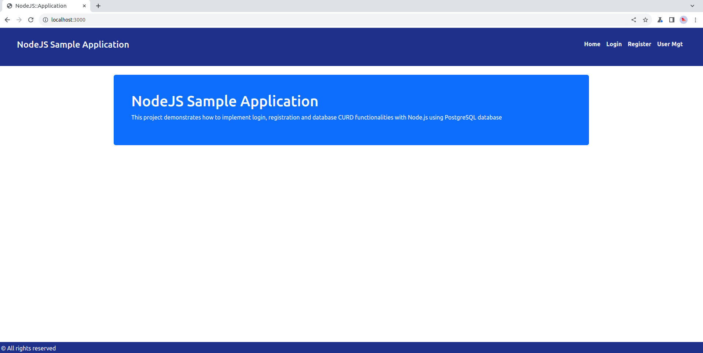
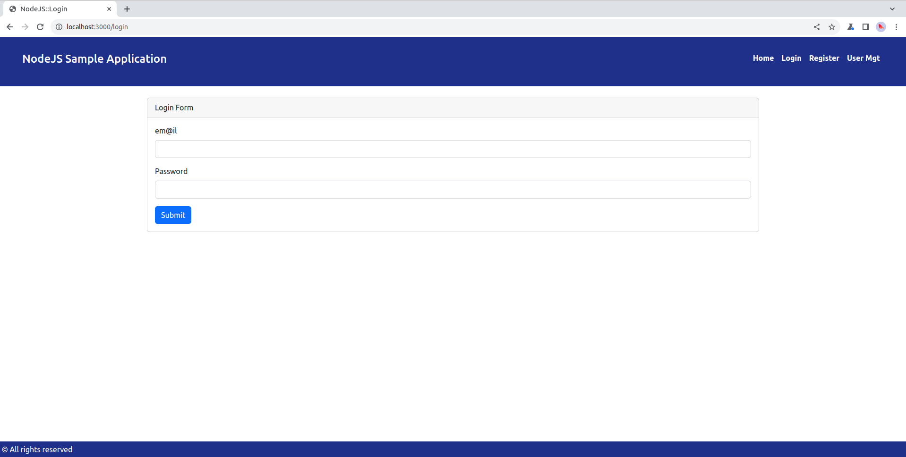
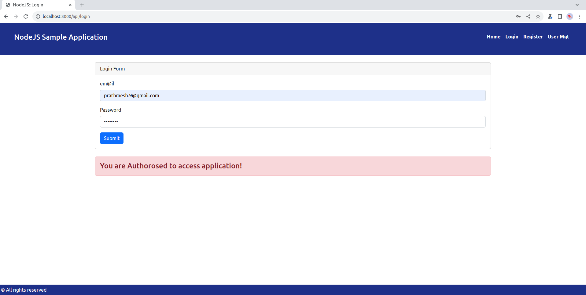
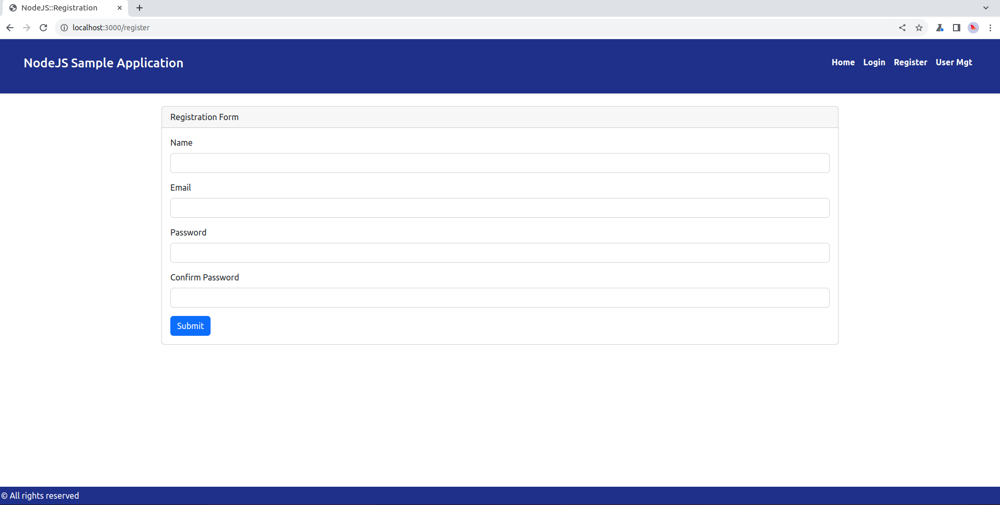
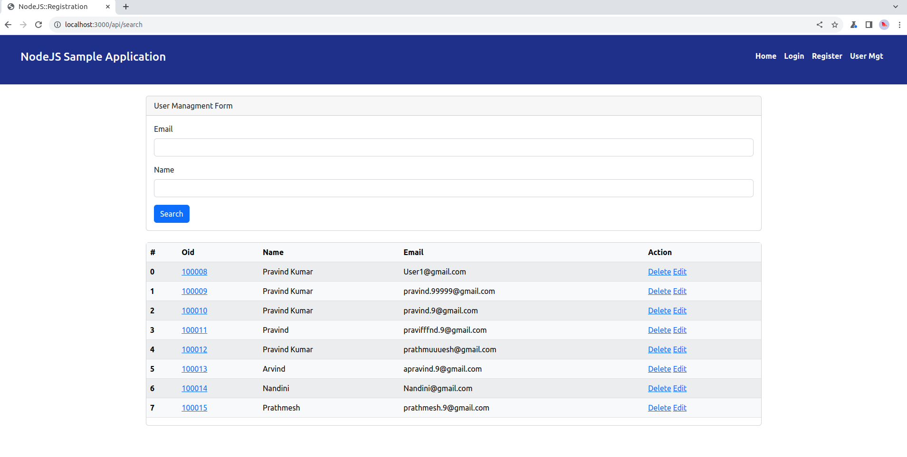

# PostgreSQL 
For this sample application PostgreSQL is used to hold the data.

## Installation 
To install PostgreSQL please follow the link - 
``` 
https://www.postgresql.org/download/

```
or PostgreSQL docker image can be used.


# Users Queries 

### Get All users
Get All user irrespctive of any where condition 
```
curl -X GET "http://localhost:3000/users" \
-H "Content-type: application/json" \
-H "Accept: application/json"
```
### Get Single user by oid
oid dynamic variable will be replace with actual oid value like 10001,10002 etc.
```
curl -X GET "http://localhost:3000/users/:oid" \
-H "Content-type: application/json" \
-H "Accept: application/json"
```
An example with real value is - 
```
curl -X GET "http://localhost:3000/users/10001" \
-H "Content-type: application/json" \
-H "Accept: application/json"
```
### Create a user
To create a new user need to pass the user details in request body 
```
curl -X POST "http://localhost:3000/users" \
-H "Content-type: application/json" \
-H "Accept: application/json" \
-d '{"oid":10004, "name": "Pravind Kumar", "email":"pravind.9@gmail.com"}'
```

### Update an user using OID
To update an user need to pass that user oid, the curl command looks like. Oid will be dynamic value.
```
curl -X PUT "http://localhost:3000/user/:oid" \
-H "Content-type: application/json" \
-H "Accept: application/json" \
-d "data that is need to update"
```

An example with real value is - 
```
curl -X PUT "http://localhost:3000/users/10001" \
-H "Content-type: application/json" \
-H "Accept: application/json" \
-d '{"name": "Pravind", "email":"pravind@gmail.com"}'
```
### Delete user
To delete a user need to pass the OID of that records to avoid any data inconsistency.

```
curl -X DELETE "http://localhost:3000/user/:oid" \
-H "Content-type: application/json" \
-H "Accept: application/json" 
```

An example with real value is - 
```
curl -X DELETE "http://localhost:3000/users/10001" \
-H "Content-type: application/json" \
-H "Accept: application/json" 
```

# FAQ
### Cross browser
To handle cross browser need to install the packgae CORS and has to enable it.

```
npm istall cors
```
update app.js like below 
```
var cors = require('cors');
...
...
app.use(cors());
```
### Error handling
To address handling centrally need to update the app.js with error handling capabilty like below 


### Install PostgreSQL
- Download postgreSQL from here 
      ``` https://www.postgresql.org/download/ ```

- Install postgreSQL on local machine (windows), installation reference can be found here - 
> https://www.enterprisedb.com/docs/supported-open-source/postgresql/installing/windows/
-  Install postgreSQL on local machine (Linux), installation - 
> https://www.enterprisedb.com/docs/supported-open-source/postgresql/installing/linux_x86_64/

- Install PGAdmin to access postgreSQL, Installation guide for PGAdmin at https://www.pgadmin.org/download/pgadmin-4-windows/

- Once PostgreSQL is ready then need to create a sample table to test CURD (Create, Update, Read and Delete) operations. To create a table SQL is as below - 
```
DROP TABLE IF EXISTS public.users;

CREATE TABLE IF NOT EXISTS public.users
(   oid bigint GENERATED ALWAYS AS IDENTITY NOT NULL,
    name varchar(100),
    email varchar(100),
	password varchar(250),
    CONSTRAINT "USERS_PK" PRIMARY KEY (oid)
)TABLESPACE pg_default;

ALTER TABJLE IF EXISTS public.users
    OWNER to postgres;

COMMENT ON TABLE public.users
    IS 'nodejs test tables';

SELECT setval('public.users_oid_seq', 100001, true);
ALTER SEQUENCE IF EXISTS public.users_oid_seq
    START 100001
    MINVALUE 100001
    CYCLE;

DELETE FROM public.users;

INSERT INTO public.users(name, email) values ('Prathmesh', 'prathmesh@gmail.com');
INSERT INTO public.users(name, email) values ('Deveshee', 'deveshee@gmail.com');

SELECT oid, name, email, password FROM public.users;

```

### How to Test this application
- To start in dev mode. change director to project folder in our case this is /home/shiv/devel/repo/node-app/myapp
``` 
$ cd /home/shiv/devel/repo/node-app/myapp
$ npm start 

> myapp@1.0.0 start
> nodemon app.js

[nodemon] 3.1.0
[nodemon] to restart at any time, enter `rs`
[nodemon] watching path(s): *.*
[nodemon] watching extensions: js,mjs,cjs,json
[nodemon] starting `node app.js`
Application running on port 3000!
```
- under app.js the running port is define 3000, hence above command will start node server on port 3000. 

### NodeJS installation
```
https://nodejs.org/en/learn/getting-started/how-to-install-nodejs

Additional package installation (on linux)
$ npm install cookie-session --save
$ npm install core --save
$ npm install cors --save
$ npm install sequelize --save
$ npm install jsonwebtoken --save
$ npm install bcryptjs --save
$ npm install pg --save
$ npm install express --save
$ npm install dotenv --save
$ npm install hbs --save
$ npm install nodemon --save

For windows 
c:/> npm install cookie-session --save
c:/> npm install core --save
c:/> npm install cors --save
c:/> npm install sequelize --save
c:/> npm install jsonwebtoken --save
c:/> npm install bcryptjs --save
c:/> npm install pg --save
c:/> npm install express --save
c:/> npm install dotenv --save
c:/> npm install hbs --save
c:/> npm install nodemon --save
```

### Demo Screen
#### home Screen
- Home Screen


- Login screen 


- Login screen (success)


- User registration


- User Managment
